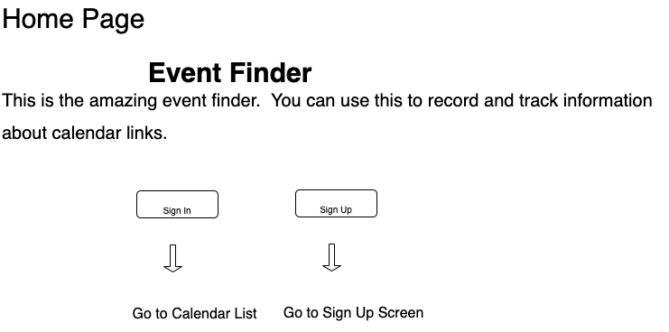

[checklist]: planning_docs/checklist.md
[issues]: planning_docs/issues.md
[tasks]: planning_docs/tasks.md
[requirements]: planning_docs/requirements.md
[issues]: planning_docs/issues.md
[stories]: planning_docs/stories.md

This repository includes code for the Event Finder Plus UI.  Most of the documentation for this project can be found here, with the exception of the ERD, which is stored on the backend.  For backend code and documentation, see [backend][backend].

[backend]: https://github.com/ethanstrominger/event-finder-plus-uiPlus/

- [Project Description ](#project-description)
- [Technologies Used ](#technologies-used)
- [Planning](#planning)
- [Execution](#execution)
- [Testing](#testing)
- [Challenges ](#challenges)
- [Backlog ](#backlog)
- [User Stories Summary ](#user-stories-summary)
- [Mockups ](#mockups)

# Project Description 
Version 0.2.x of this project lets you create and update a list of calendars with the URL.  While limited in scope, the project provides a template and framework for version 1.x. Version 1.0 will enable you to download all the events associated with the calendar, write notes about the events, and be notified when any new events appear or existing events change.  Version 1.1 will download events from EventBrite and Meetup with criteria you specify.

# Technologies Used 
Front end:
JavaScript, HTML handlebars, BootStrap, CSS

Backend:
Postgres, Ruby on Rails, RSpec, simplecov (for code coverage)

# Planning 

I created the following planning docs
- [stories][stories]
- [high level story summary](#user-stories-summary)
- ERD (see [backend][backend] for more details)

I reviewed
- technical [checklist][checklist]
- requirements [requirements]

# Execution 
I started by following the [checklist][checklist].  I committed small increments and did testing before committing.  As issues came up (bug, different approach, specific tasks not covered by checklist), I added these to either [issues][issues] or [tasks][tasks].

For debugging, I reviewed output from the developer tool, I used console.log to follow flow and value of variables.  I also used google when not familiar with syntax or how to do something in a particular technology.

When I completed most of the [checklist][checklist], I reviewed the [requirements][requirements] and did a final round of bug testing and reviewing UI.

I then posted for review by others.

# Testing 
I planned on doing BDD and TDD for backend.  However, so much was autogenerated
and worked automatically, in v 0.2 I wrote a single backend feature test.  code
coverage can be seen [here](testreports/index.html). All
other testing was manual.

For 0.3, I will add backend feature level tests for existing features and do some unit tests for the
backend.  Depending on how much time the unit tests take, I will complete all
unit tests.

UI tests will be evaluated for 0.3.  These are more difficult and fragile because
the UI depends so much on interactions between elements and small changes can
cause the tests to break..

# Challenges 
- Chaining of promises, catches sometimes obscured errors.  **Solution:** Raise exceptions in catches, review promises, and review my code.
- Not knowing what was sent to server, implemented complex logging on server, would have been easier to implement on UI, print args.  Was interesting though. **Solution:** Implement logging on server or add debug message on UI.
- Doing too much (show particularly egregious case) **Solution:** Always fix one thing at a time, minimize files changed if possible.
- Adding shared code proved tricky in UI, as differences in elements can cause different behavior.  **Example:** Bug occurred when I had a method that dir $(form).remove that was called from handlebar and then called it from index.html.  When called from index.html, form was permanently removed.  **Solution:** Do more testing when sharing code.  Move everythng to handlebars so elements are more similar.
- Too obsessed (what about the rest of my life).  **Solution:** Bike (I do this).  Schedule time during the week to do something with my wife.
- Mind racing too much?  **Solution:** Checklists and task list helped.

# User Stories Summary 
At a high level, 0.2 implemented
  - Backend
    - CRUD for calendars resource on backend
    - Add foreign key relation to users
    - Restrict index to only show calendars created by user
    - Create an RSpec test for get (was planning on doing all)
  - Front end
    - Create account
    - Sign in
    - CRUD for calendars
    - Change passwords

For more details on stories, see [stories][stories].

# Backlog 

- Technical debt
  - Exception when catch
  - Move functions from ui to events
  - Move everything to handlebars
- Features
  - Load calendar events from calendar URL
  - Load from EventBrite and Meetup
  - Cache sign in info so don't need to sign in again.  If signed in, bring right to list screen on refresh
- UI
  - Hide buttons when go to Sign In and Sign Up screens
  - Hide message bar rather than set text to blank, which leaves green bar

For more details on stories, see [stories][stories].

# Will this work?

# Mockups 

